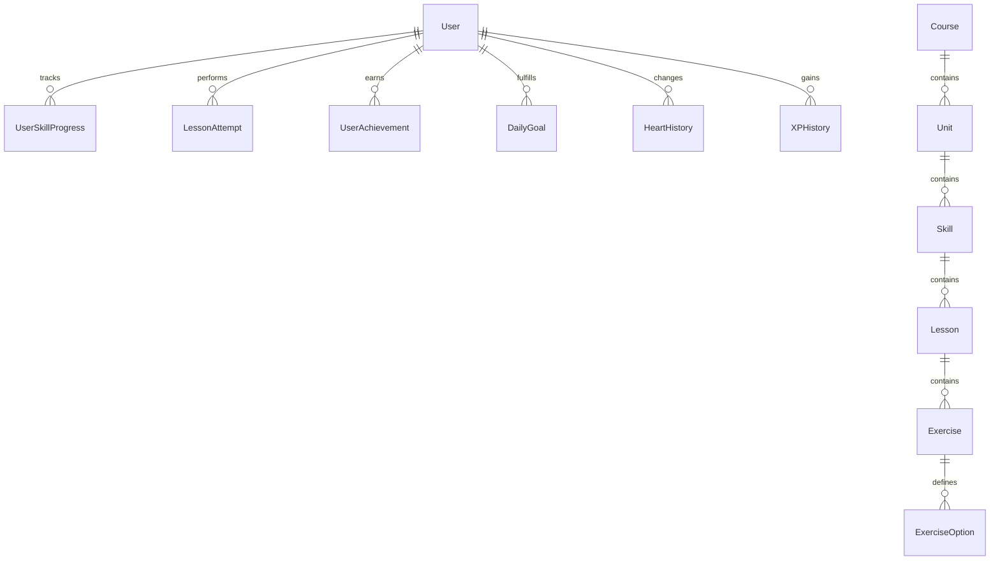

# Duolingo Web App Clone

A production-quality Duolingo clone designed and implemented as a full-stack SDE assignment. This project includes a FastAPI (Python) backend with SQLite database seeding, and a Next.js 15 (TypeScript) frontend powered by Zustand, React Query, and Framer Motion.

---

## 🛠️ Tech Stack

### Frontend
- **Framework**: Next.js 15 (App Router)
- **State Management**: Zustand (Client State), React Query (Server State)
- **Styling**: Tailwind CSS
- **Animations**: Framer Motion
- **Icons**: Lucide Icons
- **Effects**: canvas-confetti

### Backend
- **Framework**: FastAPI (Python)
- **Database**: SQLite (SQLAlchemy ORM)
- **Validation**: Pydantic
- **Development Server**: Uvicorn

---

## 📁 Folder Structure

```text
DuolingoH/
├── backend/
│   ├── app/
│   │   ├── __init__.py
│   │   ├── database.py   # SQLAlchemy configurations & session local
│   │   ├── models.py     # SQLAlchemy models detailing relationships
│   │   ├── schemas.py    # Pydantic schemas for endpoint validation
│   │   └── main.py       # FastAPI application and route endpoints
│   ├── seed.py           # Database seeder (creates tables & initial data)
│   └── requirements.txt  # Python backend dependencies
├── frontend/
│   ├── src/
│   │   ├── app/
│   │   │   ├── page.tsx          # Main Learning Path Page
│   │   │   ├── leaderboard/      # Weekly League Page
│   │   │   ├── achievements/     # User Achievements Page
│   │   │   ├── profile/          # Learner Profile Page
│   │   │   └── lesson/[id]/      # Interactive Lesson Player Engine
│   │   ├── components/
│   │   │   ├── Sidebar.tsx       # Primary navigation
│   │   │   ├── StatsHeader.tsx   # Top stats bar
│   │   │   └── LearningPath.tsx  # Skill progress and launch dialog
│   │   ├── providers/
│   │   │   └── QueryProvider.tsx # TanStack React Query provider
│   │   └── store/
│   │       └── useStore.ts       # Zustand store for lesson state
│   ├── package.json
│   └── tailwind.config.ts
└── README.md
```

---

## 🗄️ Database Schema

### ER Diagram (Markdown Representation)



### Table Details
1. **User**: Learner stats (`hearts`, `max_hearts`, `xp`, `streak`, `crowns`).
2. **Course**: Active course languages (`name`, `language_code`, `flag_code`).
3. **Unit**: Sections inside the learning track.
4. **Skill**: Progress points inside each unit (`name`, `description`, `icon_name`).
5. **Lesson**: Learning segments (`xp_reward`, `order`).
6. **Exercise**: Questions of various types (`multiple_choice`, `translate_word_bank`, `fill_blank`, `type_answer`, `match_pairs`).
7. **ExerciseOption**: Multiple choice options or word bank tokens.
8. **UserSkillProgress**: Tracks crown progress for skills.
9. **Leaderboard**: Records weekly accumulated XP across learners.
10. **DailyGoal**: Fulfills target goal checking.

---

## 🔌 API Documentation

| Endpoint | Method | Description |
| :--- | :--- | :--- |
| `/api/users/me` | `GET` | Retrieve the active user's stats and configurations. |
| `/api/users/refill-hearts` | `POST` | Refill user hearts to maximum. |
| `/api/courses` | `GET` | List all available language courses. |
| `/api/learning-path` | `GET` | Get current course, units, skills, and current user progress. |
| `/api/lessons/{lesson_id}` | `GET` | Get lesson details with all corresponding exercises. |
| `/api/exercises/{exercise_id}/submit` | `POST` | Submit an answer and decrement hearts if incorrect. |
| `/api/lessons/complete` | `POST` | Finish lesson, award XP, update streak, achievements, and leaderboard. |
| `/api/leaderboard` | `GET` | Get current weekly league standings. |
| `/api/achievements` | `GET` | Fetch list of achievements and progress for the current user. |
| `/api/daily-goal` | `GET` | Retrieve daily XP goal status. |

---

## 🚀 Installation & Local Running

### 1. Setup Backend
```bash
cd backend
python -m venv venv
# On Windows
.\venv\Scripts\activate
# On macOS/Linux
source venv/bin/activate

pip install -r requirements.txt
python seed.py
uvicorn app.main:app --reload --port 8000
```

### 2. Setup Frontend
```bash
cd frontend
npm install
npm run dev
```
Open [http://localhost:3000](http://localhost:3000) to view the application.

---

## 🎤 Interview Explanation

### Why this architecture?
1. **Separation of State**: Server state (learning path progress, leaderboards) is managed cleanly with **React Query**, ensuring auto-refetching, caching, and data synchronization. Client-only state (current card index, selections, matching pairs) uses **Zustand** for lightweight and high-performance render cycles.
2. **Cheat Prevention**: Exercise solutions (`correct_answer`) are NOT returned directly inside the initial exercise request. Validation is performed securely on the FastAPI server, preventing players from reading the DOM to cheat.
3. **Premium UX**: Leverages **Framer Motion** for spring-based click mechanics, card shakes, and screen transitions, replicating the signature Duolingo bouncy styling.
